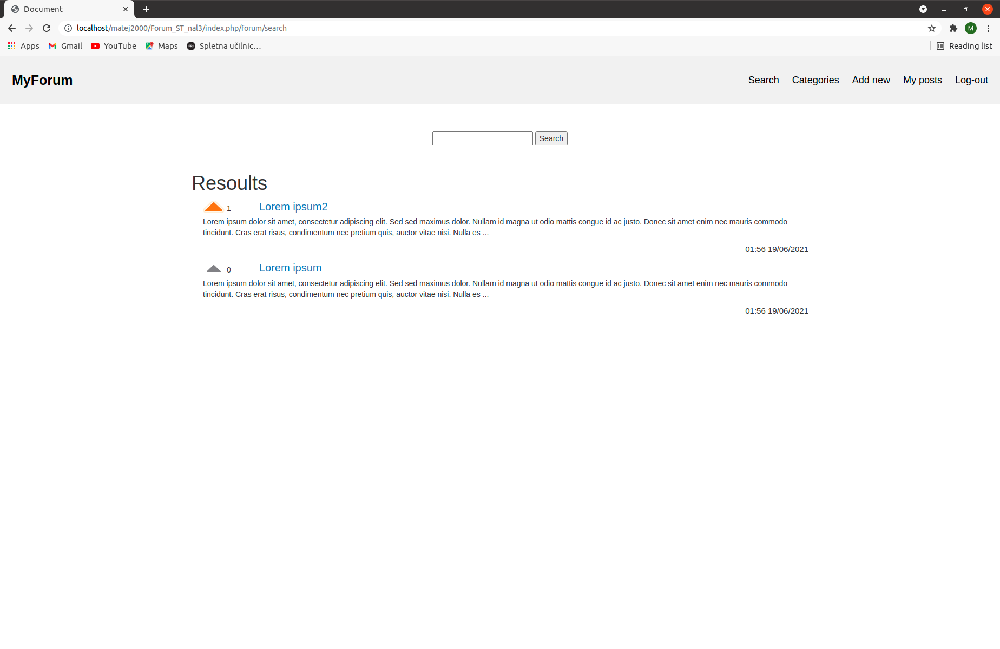
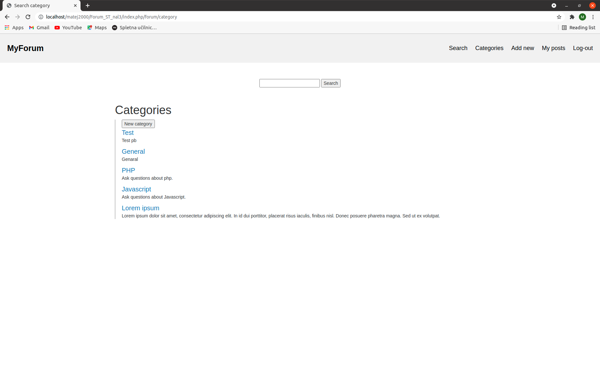
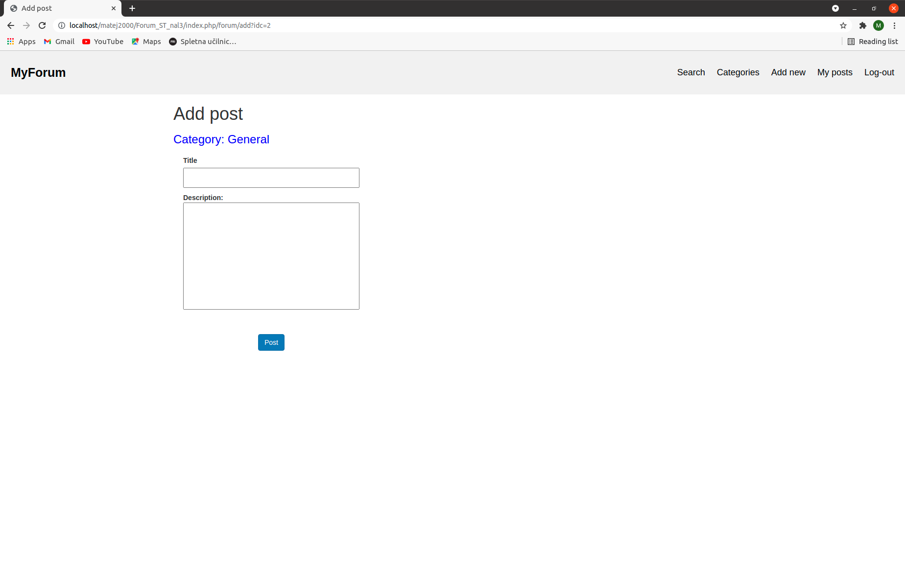
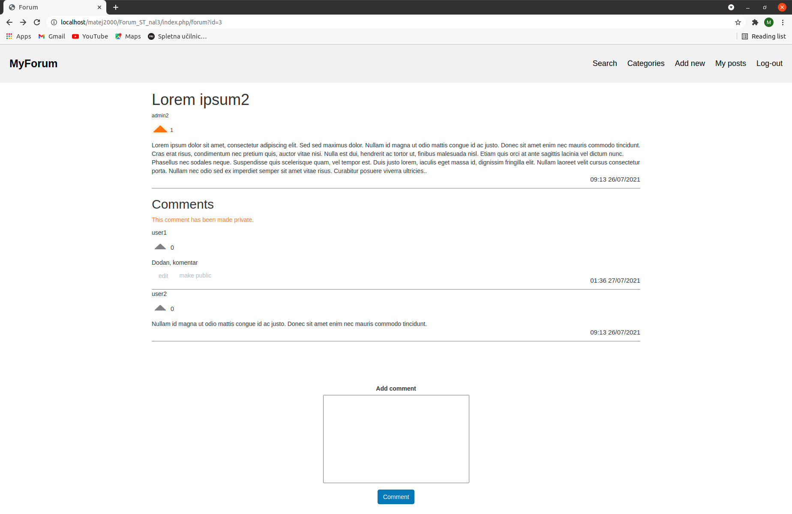
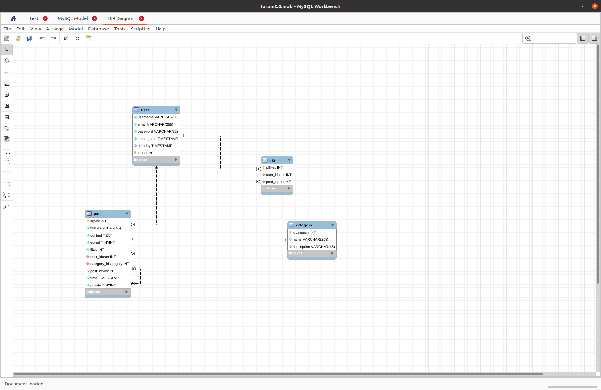

# MyForum

MySql hosting: https://www.freemysqlhosting.net  
URL: https://myforum.azurewebsites.net

## Uvod

MyForum je splošno namesnki forum. Narejen je bil za seminarsko nalogo pri predemtu Spletne tehnologije. Spletna aplikacija ima mvc strukturo. Forum omogoča naslednje funkcionalnosti:
* Prijava in registracija uporabnikov.
* Dodajanje objav.
* Všečkanje objav.
* Dodajanje komentarjev.
* Popravljanje objav in komentarjev.
* Naredi objavo privat.
* Dodajanje kategorij.

## Podatkovna baza
Shema podatkovne baze:

